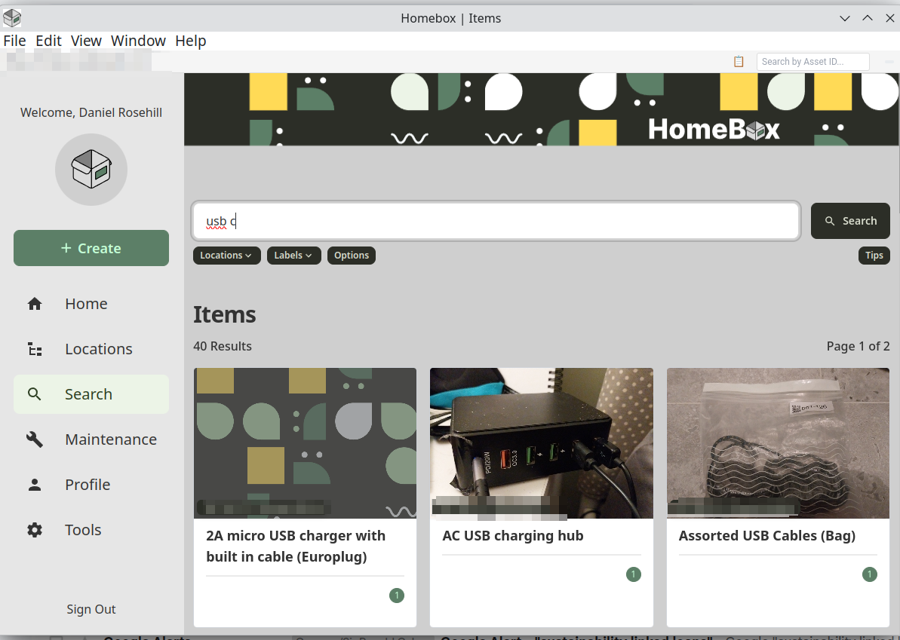
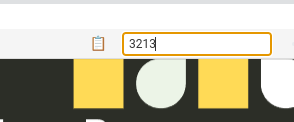
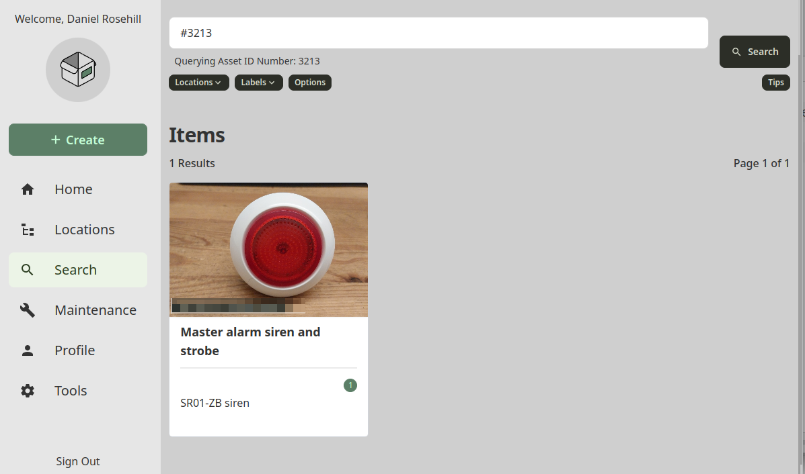
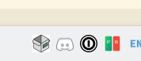
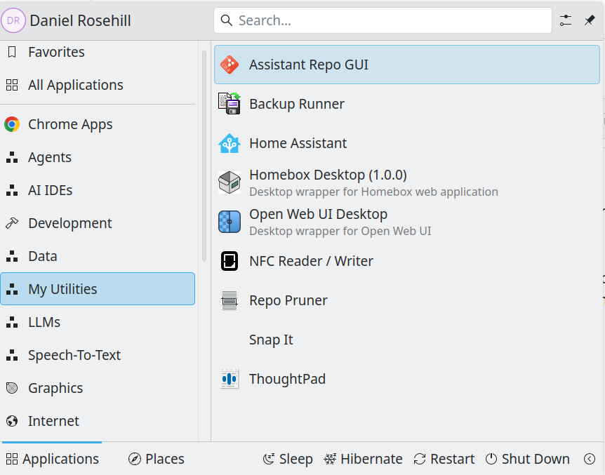

# Homebox Desktop Wrapper (Electron, Linux Desktop)

[](https://github.com/sysadminsmedia/homebox)
[](https://electronjs.org)
[](https://appimage.org)



24-Feb-25

This repository provides starter code for a basic desktop wrapper for a self-hosted Homebox instance. 

Because every public instance will have a different URL and some mightn't be on the public internet at all, I've used `.env.example`.

Some notes to support a quick spin-up are below:

## Cloudflare Access Authentication

I'm a fan of using Cloudflare Access to secure self-deployed software, but not everybody is.

For that reason there's:

- `main.js` - Default build file, passes Cloudflare service token 
- `main-no-cloudflare.js` - Does what it says on the tin; no CF token  

## Setup Script

Use `setup.js` to quickly populate your environment variables with your secrets and choose the right build file for your preferred authenticastion flow.

## A Couple Of My Own Touches

Having build out a crazy inventory with more than 4,000 items, I realise that a speedy UI is the name of the game when it comes to making an elaborate but wonderful system like Homebox *help* you to get organised and not bog you down in system upkeep.

### Search By Asset ID!

 

A feature which I would love to see added to the core software is asset ID lookup. But as a stopgap, I added a top navigation bar with a `search by asset ID` feature.
 
To search by asset ID in Homebox, you prepend a hashtag to the asset ID number. 

Asset ID 1 becomes: https://yourhomebox.com/items?q=%231  
Asset ID 231 becomes: https://yourhomebox.com/items?q=%23231

This search box simply does that translation to speed up lookups by asset number. Use 'enter' to search.

**Results page**:



### Clipboard

I use NFC tags to track my more important home inventory items, so having quick asset to item URLs to write the tags with really speeds things up. 

Although the Homebox team already implemented this I figured that another icon couldn't hurt. So there's another one above the topbar,.

### System Tray Icon

Every good wrapper needs a system tray icon so here's one:



### Add To Your Desktop Menu!



## Setup

1. Clone this repository
2. Copy `.env.example` to `.env` and fill in your credentials:
   - `HOMEBOX_URL`: Your Homebox instance URL
   - `CF_ACCESS_CLIENT_ID`: Your Cloudflare Access Client ID
   - `CF_ACCESS_CLIENT_SECRET`: Your Cloudflare Access Client Secret

3. Install dependencies:
```bash
npm install
```

4. Run the application:
```bash
npm start
```

## Building

To build the application as an AppImage:

```bash
./build-appimage.sh
```

To build to other Linux packages, modify the build script accordingly.

## Features

- System tray integration
- Keyboard shortcuts:
  - `Alt+H`: Toggle window visibility
  - `Alt+R`: Reload page
  - `Alt+D`: Toggle DevTools
  - `Alt+Q`: Quit application

---
*Special thanks to the Homebox team for their amazing work in creating such a wonderful inventory management system!*
